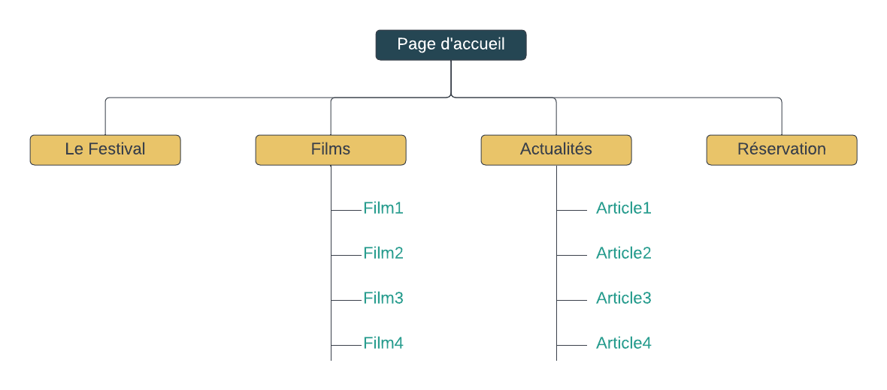
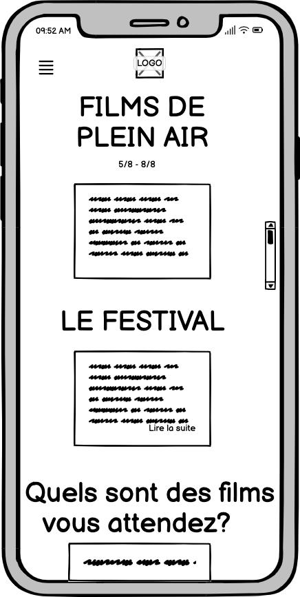

# Festival de Films

Website mockup for a film festival, organized by an association. The purpose of creating this website is to promote for the festival, to communicate with public about films and news, and to let potential spectateurs to book tickets.

A mockup is written in HTML, SASS, and Bootstrap.

Here is the website structure.

The wireframes are designed using Balsamique tool. The website will render well on a variety of devices and window.

